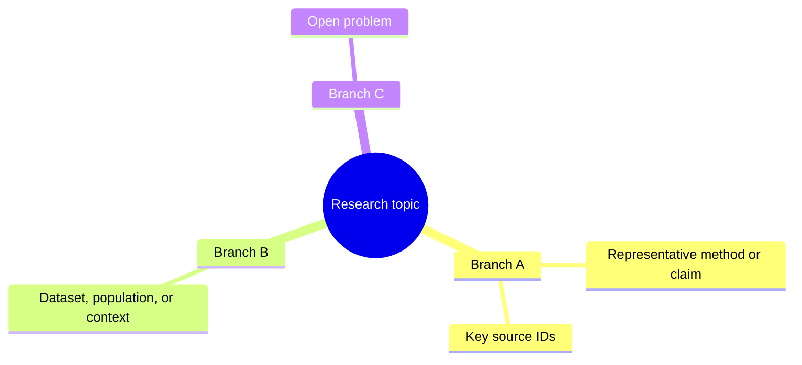
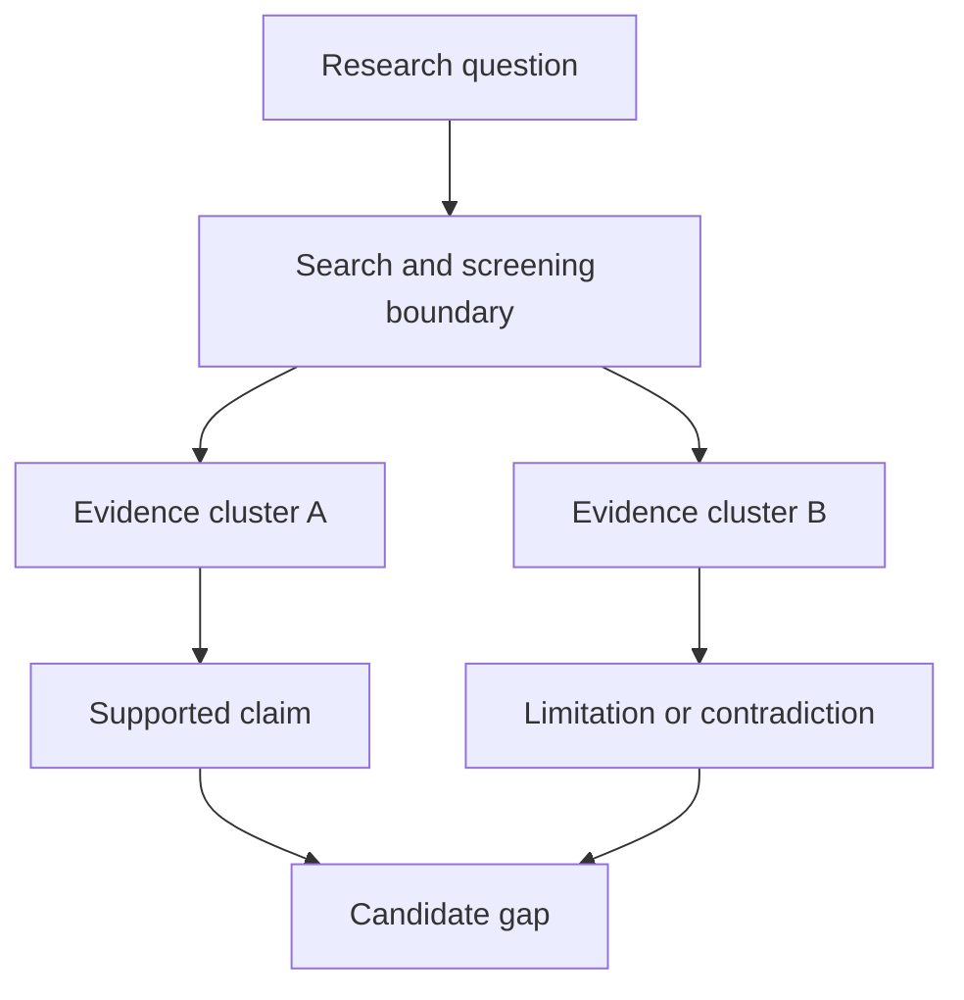
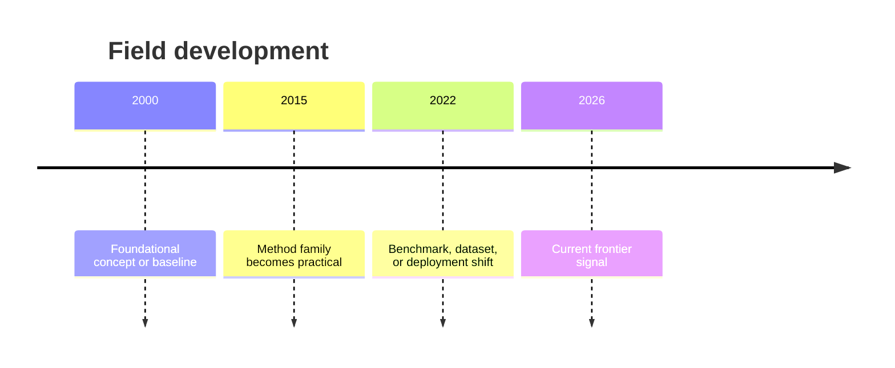
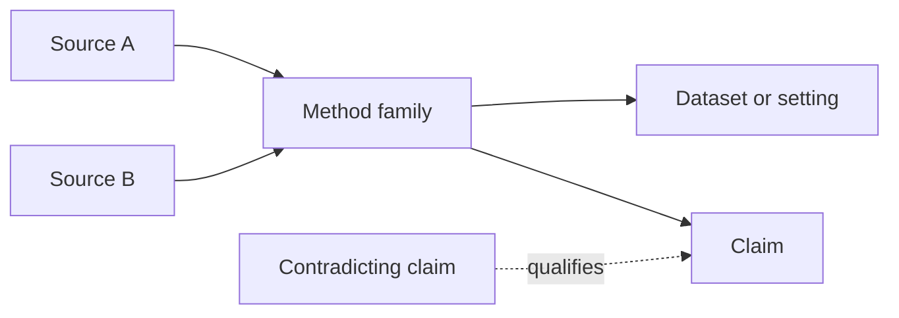
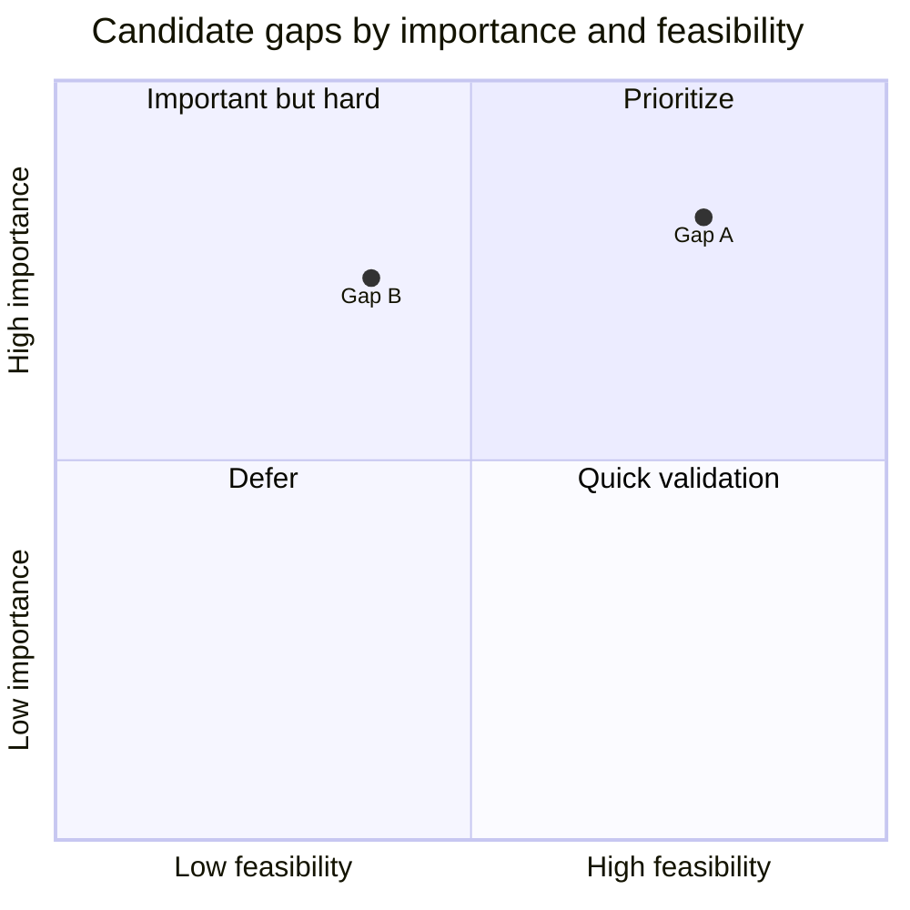

# Output Templates

Use these templates when producing a research report. Expand or adapt fields to the discipline, but do not silently remove core traceability fields.

## 1. Topic decomposition

| Dimension | Guiding question | Current definition | Boundary or exclusion |
|---|---|---|---|
| Object | What population, material, system, or phenomenon? | | |
| Problem | What question, mechanism, task, or pain point? | | |
| Method | What theory, technique, instrument, or intervention? | | |
| Context | In what application, geography, environment, or constraint? | | |
| Outcome | What effect, metric, cost, risk, or decision target? | | |

## 2. Bilingual keyword matrix

| Concept block | Chinese core terms | English core terms | Synonyms/variants/acronyms | Broader/narrower or adjacent terms | Ambiguous terms to exclude |
|---|---|---|---|---|---|
| Object | | | | | |
| Problem | | | | | |
| Method | | | | | |
| Context | | | | | |
| Outcome | | | | | |

## 3. Search-string plan

| Search purpose | Platform/source type | Exact query | Filters | Reason |
|---|---|---|---|---|
| Discover terminology | | | | |
| Find reviews | | | | |
| Find seminal work | | | | |
| Find recent frontier | | | | |
| Find failures/critiques | | | | |
| Validate novelty | | | | |

Preserve the query exactly as executed in the search log; do not replace it later with a cleaned-up approximation.

## 4. Article/source comparison

Default schema:

| Paper/source | Year | Problem | Method | Data/sample | Metrics/outcomes | Main contribution | Limitations | Reusable insight |
|---|---:|---|---|---|---|---|---|---|
| Citation + stable link | | | | | | | | |

Optional computational/AI extensions:

| Code/data | Baselines | Compute | Ablation | Robustness/generalization | Reproducibility |
|---|---|---|---|---|---|
| | | | | | |

Optional experimental/clinical extensions:

| Design | Sample size | Comparator | Effect size/uncertainty | Bias/validity | Replication |
|---|---:|---|---|---|---|
| | | | | | |

Optional humanities/social-science extensions:

| Theory | Corpus/archive | Analytical lens | Context | Alternative interpretation | Positionality/limits |
|---|---|---|---|---|---|
| | | | | | |

## 5. Claim synthesis

| Claim | Supporting sources | Contradicting/qualifying sources | Evidence strength | Conditions | Interpretation |
|---|---|---|---|---|---|
| | | | | | |

Use this table to prevent majority-by-paper-count reasoning. Weigh design quality, independence, relevance, and uncertainty.

## 6. Candidate gap ranking

| Candidate gap | Closest prior art | Why it matters | Evidence gap exists | Evidence against | Feasibility | Decisive test | Confidence |
|---|---|---|---|---|---|---|---|
| | | | | | | | |

Avoid a single unexplained numerical score. If ranking is needed, explain the ordinal criteria and preserve the underlying arguments.

## 7. Mermaid visualization templates

Use diagrams only when they clarify the analysis. Keep labels short and cite the table rows, source IDs, or references that justify non-obvious relationships.

### Domain or concept map

### Method or evidence flow

### Development timeline

### Relationship graph

### Gap positioning

If the renderer does not support `quadrantChart`, replace it with a compact table using the same axes and rationale.

## 8. Literature file index

| Source ID | Local file | Title | DOI/URL | Access status | Download or access date | Rights/access note |
|---|---|---|---|---|---|---|
| S01 | `literature/papers/s01-author-year-short-title.pdf` | | | downloaded / metadata-only / unavailable | | |

Use stable, deduplicated file names. Distinguish preprint, conference, journal, accepted manuscript, and technical-report versions when they differ.

For unavailable sources, also record them in `literature/unavailable.md`:

| Source ID | Title | DOI/URL | Attempted source | Date | Reason not downloaded | How it was used |
|---|---|---|---|---|---|---|
| | | | publisher / DOI / repository / author page | | paywalled / access denied / no PDF / uncertain rights | metadata only / abstract only / excluded |

## 9. Final `report.md` skeleton

1. Executive conclusion
2. Scope and research questions
3. Topic decomposition
4. Bilingual keywords and search strings
5. Search method and coverage limits
6. Field map and development, including Mermaid diagrams where useful
7. Article/source comparison
8. Consensus and conditional findings
9. Disputes, failures, and boundary conditions
10. Recent frontier signals
11. Candidate research gaps, including gap positioning when useful
12. Recommended research questions or experiments
13. Literature files and unavailable sources
14. Limitations of this investigation
15. References
